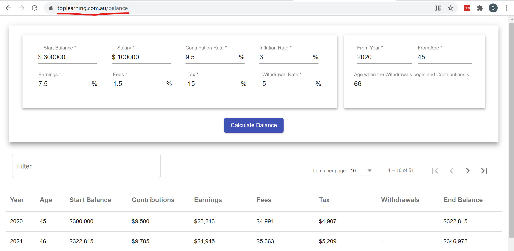

# Capital Balance Projection by GregLuo(0406518207)

Implemented with Angular 12, Material Design and FxLayout

I choose material design and fxLayout because they can save my time to implement responsive UI.
I choose chart.js with version 2.4.3 because the latest version of chart.js doesn't work with Angular 12

I don't provide any document about my code since it is self-explaining enough.

## Play it directly

Open the URL [https://toplearning.com.au/balance](https://toplearning.com.au/balance)  to try it. Have fun! (I know this is unnecessary, and I did it just for fun).

## Run the simulator

Run `yarn`, then `ng serve` for a dev server. Navigate to `http://localhost:4200/`.

## Running unit tests

Run `ng test` to execute the unit tests.

